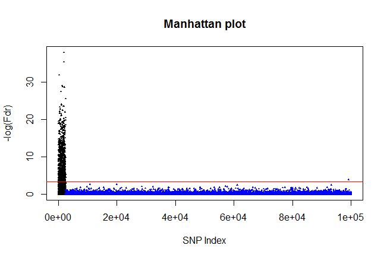

#introduction#
RepFDR is a package used for the replicability analysis of outcomes...

#Model#
Model Definition comes here

#Example#
The following is an example for running a complete procedure via RepFDR
We first simulate out data, two studies with 1e4 SNPs each. the first 2000 SNPs are non null, and sampled from N(0,4^2)
```{r, eval = TRUE}
library(repfdr)

# Generate two studies,first 1000 SNPS are non null
set.seed(1)
my_zmat = matrix(rnorm(10000*2),ncol = 2)
n1 = 1000
my_zmat[1:(2*n1),1] = rnorm(2*n1,0,4)
my_zmat[1:(2*n1),2] = rnorm(2*n1,0,4)

```

We perform a discretization of our data via \code{ztobins}
```{r,eval = TRUE, fig.width=6, fig.align='center'}
# perform discretization, visualize results
res = ztobins(zmat = my_zmat,n.association.status = 2,
              plot.diagnostics = T,nr.plots.in.window = 1,df = 20,n.bins = 50)

```

We perform replicability analysus via the \code{repfdr function}.
The following sections were not automatically evaluated during vignette runtime, due to long execution time (up to 20 sec.)
```{r,eval = FALSE}

# perform replicability analysis
repfdr.res = repfdr(res$pdf.binned.z, res$binned.z.mat,
                    non.null = 'replication',
                    control = em.control(tol =  1e-4,verbose = T))
```

We take a look at the results:
* Local FDR posterior probabilites
* LDR for each SNP
```{r, eval = FALSE}

#probability for each null/non null combination
repfdr.res$Pi

#fdr and Fdr for each SNP
head(repfdr.res$mat)

# computing local FDR
ldr.res = ldr(res$pdf.binned.z, res$binned.z.mat,repfdr.res$Pi)

#results for local ldr matrix
dim(ldr.res)
# ldr for first three SNPs
ldr.res[,(1:(3+2))]
```


#Example for using Clusters#
The following example shows how RepFDR can be used for performing analysis on clusters. We show an example with 9 clusters, 2 studies in each cluster.

We generate the data:
```{r, eval = TRUE}

#function generates data with 10^5 SNPS, 300 are non null in each cluster.
demo_data = function(seed=1,p=100000,p1=300){
  set.seed(seed)
  
  tau = 4
  m_studies = 16
  X = matrix(rnorm(p*m_studies),nrow = p)
  for(i in 1:8){
    temp1 = rnorm(p1,0,tau)
    X[(1:p1) + p1*(i-1) , 2*i-1] = temp1 + rnorm(p1,0,0.5)
    X[(1:p1) + p1*(i-1) , 2*i  ] = temp1 + rnorm(p1,0,0.5)
  }
  pX = 2*pnorm(abs(X),lower.tail = F)
  ret = list()
  ret$X = X
  ret$pX = pX
  return(ret)
}

dat = demo_data()
pX = dat$pX
X = dat$X

```

below are two examples, for within cluster dependence of SNPS, and between cluster dependence of SNPs
```{r,eval = TRUE, fig.width=6, fig.height=12, fig.align='center'}

par(mfrow=c(2,1))
# inside cluster dependence
plot(X[,1],X[,2],
     main = 'Within cluster dependence\n of Z scores',
     xlab = 'Z scores, Study 1',
     ylab = 'Z scores, Study 2' )

# no dependence between clusters
plot(X[,1],X[,3],
     main = 'Between cluster dependence\n of Z scores',
     xlab = 'Z scores, Study 1',
     ylab = 'Z scores, Study 3' )
par(mfrow=c(1,1))

```

We perform discretization of the Z scores:
```{r,eval= FALSE}

ztb = ztobins(X,n.association.status = 3,df = 15,
              plot.diagnostics = T,n.bins = 50,
              nr.plots.in.window = 1)

pdf.binned.z = ztb$pdf.binned.z
binned.z.mat = ztb$binned.z.mat

```

We now run repfdr on clusters, with the correct partition to clusters (the partition for which to run the procedure has to be determined).

By running the function on clusters, we also get the LDR results.
```{r, eval=FALSE}


# we have 8 clusters, two observations in each cluster
clusters = as.integer(c(1,1,2,2,3,3,4,4,5,5,6,6,7,7,8,8))


res = repfdr(pdf.binned.z,binned.z.mat,non.null = 'replication',
             clusters = clusters,
             clusters.ldr.report = 'ALL',
             clusters.verbose = T,
             control = em.control(verbose = F,tol = 1e-3))
#These are the local FDR for each SNP
dim(res$mat)
head(res$mat)
# These are the local FDR for each non null combination and SNP
dim(res$ldr)
View(res$ldr)
# Pi matrix:
dim(res$Pi)
View(res$Pi)


# we display the results

#how many are significant after correcting to multiplicity
Fdr = res$mat[,2]

```


We draw a manhattan plot for the SNPS with lowered Fdr

```{r,eval= FALSE}

#Manhattan plots
#first 2400 are the non null
plot(-log10(Fdr),ylab = '-log(Fdr)',xlab = 'SNP Index',
     col = c(rep(1,2400),rep(4,1e5-2400)),
     main = 'Manhattan plot',cex=0.2,pch=2)
abline(h = -log10(0.05),col = 2)

Reported = which(Fdr<=0.05)
length(Reported)
FP = Reported[Reported>2400]
length(FP)

```

Where we have 1174 reported SNPs, 70 of which are false positive.

