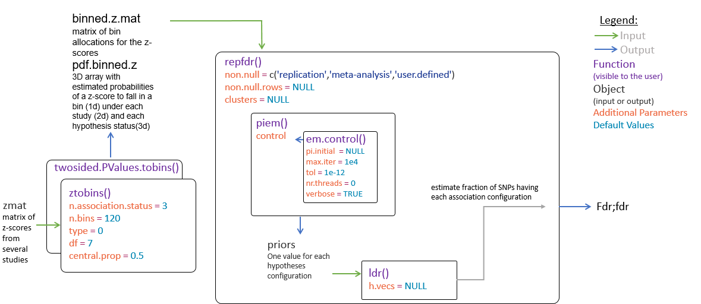
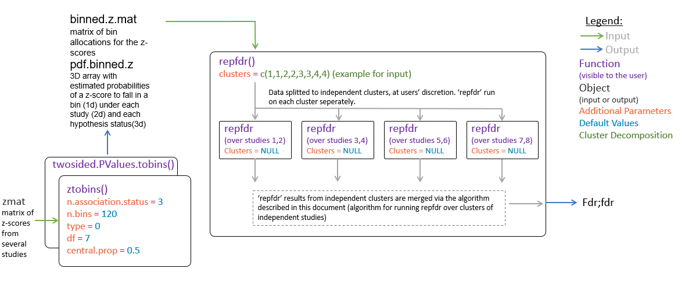

---
title: "repfdr: Package for Replicability Analysis for Multiple Studies of High Dimension"
author: "Barak Brill, Ruth Heller, Shay Yaacoby, Daniel Yekutieli"
date: "2017 - 07 - 17"
output: pdf_document
toc: TRUE
vignette: |
  %\VignetteIndexEntry{repfdr}
  %\VignetteEncoding{UTF-8}
---

#Introduction#
The *repfdr* package implements the eBayes replicability methodology presented in "Replicability analysis for genome-wide association studies" (Heller and Yekutieli, 2014). This vignette describes the methodology and its outputs, the structure of the package and workflow (data preprocessing, model fitting and output structure for statistical inference), and provides working examples. The Vignette also describes how the methodology may be extended for replicability analysis for a large number of studies. An appendix presents the theoretical aspects for the use of *repfdr* in this extended setting.

*repfdr* may be applied in any analysis of the same $M$ set of hypotheses across $N$ studies. For concreteness, in this vignette following Heller and Yekutieli (2014) we consider the example that the multiple studies are $N$ GWAS studying association between the same set of $M$ SNPs to the same phenotype in $N$ different populations. The null hypothesis in each GWAS for each SNP is that the SNP is unassociated to the phenotype in this particular study population. The alternative hypothesis is that the SNP is associated to the phenotype. Heller and Yekutieli (2014) also consider the case where there are two directional alternative hypotheses in each GWAS for each SNP that the SNP is either positively or negatively associated to the phenotype.

Benjamini and Heller (2008) introduced replicability as an extension of multiple testing of the meta-analysis hypotheses. The hypotheses in replicability analysis are with regard to the association status for a single SNP across the $N$ study populations. An example of a replicability null hypothesis is SNP is unassociated with the phenotype in at least $N-1$ study populations.  For $u = 0 \cdots N$, Benjamini and Heller (2008) define the $u$ partial conjunction null hypothesis "SNP is associated with the phenotype in at most $u$ populations". For multiple testing of $u$ replicability, Benjamini Heller (2008) suggest computing a p-value for testing the $u$ partial conjunction null hypothesis for each SNP and applying the Benjamini-Hochberg FDR controlling testing procedure to test the $M$ null hypotheses. Heller and Yekutieli (2014) introduced an eBayes FDR controlling methodology for replicability analysis that is shown to be considerably more powerful than the frequentist approach of Benjamini and Heller (2008), in large settings such as GWAS where the eBayes parameters can be well estimated.

##Notations and setup
The GWAS are indexed by $i = 1,...,N$ and the SNP are indexed by $j = 1,...,M$. $H_{i, j}$ is an indicator variable corresponding to the hypothesis regarding the association of SNP $j$ with the phenotype in GWAS $i$. $H_{i, j}$ may take values in either $\{ 0, 1 \}$ or $\{ -1, 0, 1 \}$. For the first option $H_{i,j} = 0$ if SNP $j$ is unassociated with the phenotype in Study $i$ and $H_{i,j} = 1$ if SNP $j$ is associated with the phenotype in Study $i$. The second option allows to further discriminate between the case that SNP $j$ is positively associated with the phenotype ($H_{i,j} = 1$) and the case that SNP $j$ is negatively associated with the phenotype ($H_{i,j} = -1$).  The association status of SNP $j$ across the $N$ GWAS is specified by the $n$-vector  $H_{j} = ( H_{1, j} \cdots H_{n, j})$. The $u$ partial conjunction null hypothesis is defined   $H^0_u = \{ h :  \sum_i I(h_i = 0 ) \le u \}$. Let $\pi(h)$ denote the proportion of SNP with association status $h$:
$$ \pi(h) :=  \# \{ j : H_j = h \}  / M. $$ For $i = 1 \cdots N$, summing $\pi(h)$ over the other $N-1$ studies, yields $\pi_{h_i, i}$ the proportion of SNPs with $H_{i, j} = h_i$.


The input for *repfdr* is a matrix $Z_{i,j}$, where $Z_{i,j}$ is the Z-score  testing the null hypothesis that SNP $j$ is unassociated with the phenotype in GWAS $i$. We assume that conditionally on $H_{i, j}$,$Z_{i,j}$ are independently distributed and that in each study the z-score distribution is the same for all SNPs with the same association status. We further assume that the distribution of $Z_{i,j} | H_{i, j} = 0$ is $N(0,1)$. We denote the distribution of $Z_{i,j} | H_{i, j} = 1$ by $f_{1,i}$ and denote the distribution of $Z_{i,j} | H_{i, j} = -1$ by $f_{-1, i}$. Thus the marginal distribution of the z-scores in Study $i$ is assumed to be drawn from the mixture distribution:
$$Z_{i,j} \sim \pi_{0,i} \cdot N(0,1) + \pi_{1,i} 
\cdot f_{i,1} + \pi_{-1,i} \cdot f_{i,-1}$$

In the Heller and Yekutieli (2014) Bayesian framework for replicability the parameter is $H_{j}$. The prior distribution for $H_{j}$ is 
$\pi(h) = \Pr( H_j = h)$. For $Z_j = (Z_{1, j} \cdots Z_{I, j})$, the likelihood is 
$$ f( z_j | h) = \Pi_{i=1}^I f_{h_i, i} (z_{i, j}).$$
The posterior probability is given by 
$$ \pi(h | z_j) = \Pr( H_j = h | Z_j  = z_j )  = \frac{ f( z_j | h) \pi(h)}
{ \sum_h f( z_j | h) \pi(h) }. $$
The local Bayes FDR for the $u$ partial conjunction null hypothesis is defined  
$$ fdr_{H^0_u} (z_j) := \Pr(H_{j} \in H^0_u | Z_j = z_j) 
= \sum_{h \in H^0_u} \pi(h | z_j). $$
The Bayes FDR corresponding to a rejection region ${\cal Z}$ a subset of $R^I$,
such that observing $Z_j \in {\cal Z}$ implies rejection of the null hypothesis
$H_{i , j} \in H^0_u$, is defined
$$ Fdr_{H^0_u} ({\cal Z}) := \Pr( H_{j} \in H^0_u | Z_j \in {\cal Z}). $$
Where the relation between the local Bayes FDR and the FDR is
$$ Fdr_{H^0_u} ({\cal Z}) = E_{ Z_j \in {\cal Z}} \  fdr^{H^0_u} (z_j). $$
Heller and Yekutieli (2014) further show that the rejection region that yields maximal power of all rejection regions with the a nominal Bayes FDR level $q$ is given by 
$$ {\cal Z}_{Bayes, H^0_u}  = \{ z_j :  fdr_{H^0_u} (z_j) \le t(q) \}. $$


##Implementation of the Bayesian approach for replicability##
*repfdr* uses the empirical distribution of the z-scores in each study to estimate $f_{i,1}$ and $f_{i,-1}$ in the $N$ studies. Once the marginal z-score distributions are specified it is possible to express the complete likelihood for the entire z-score matrix as a function of the set of SNP association status proportions $\{ \pi(h):  \forall h \}$. *repfdr* uses an EM algorithm to find the set of SNP association status proportions maximizing the complete likelihood.

Once the likelihood and prior are assessed, *repfdr* computes the local Bayes FDR for each SNP. The SNP are then sorted by their local FDR values, where ${\cal Z}_j$ is the indices of the SNP with local FDR values smaller than that of $Z_j$. The estimated replicability FDR for SNP $j$ reported in *repfdr*
is given by cumulative mean of the local FDR values
$$ Fdr_{H^0_u} (Z_j) := \frac{ \sum_{k \in {\cal Z}_j} fdr_{H^0_u} (z_k)}
{  | {\cal Z}_j | } $$


##Package structure#
`repfdr` package workflow is as follows:

1. Preprocess Z scores or 2-sided P-Values for all studies analyzed. In this step, we bin the Z scores ($|Z|$ for the 2-sided P-Value setting) into a user-defined number of bins, and estimate the probability of falling in the bin for the 2 or 3 possible different association statuses (as suggested in Efron, 2010). It also estimates the fraction of null hypotheses in each study  either by central matching (Efron, 2010), or by the plug-in estimate on p-values (Schweder and Spjotvoll,1982) . 

Users are given diagnostic plots at this stage for examining the goodness of fit:

* $\hat{\pi}_{0,i}$ - Estimator of fraction of null hypotheses in the ith study.

* $\hat{f}_{1,i}$ and $\hat{f}_{-1,i}$ - Estimators non null densities of Z scores under positive and negative association, respectivly.

This step is performed with the function `ztobins` or `twosided.PValues.tobins`.
If the diagnostic plots  show poor fit,  `repfdr`  should not be called with the output from `ztobins` or `twosided.PValues.tobins`. This step is represented in the flow chart below, along with the parameters for the preprocessing functions.

Note that  these functions can be bypassed when using the main `repfdr` function, by providing as input to `repfdr` the user's own estimates of the probability of falling in each bin with each association status.    

```{r, out.width = "500px",echo=FALSE,fig.align='center'}

```

2. Perform replicability analysis using the function `repfdr`. Input includes the estimated probability of each association status in each bin, as well as a matrix of bin membership for each SNP in each study (see the help page of `ztobins` and `twosided.PValues.tobins` for details on the outputs `pdf.binned.z` and `binned.z.mat`)

The function computes the $\hat{\pi}_{h}$ matrix, along with the *fdr* and *Fdr*.

The function allows several methods of analysis:

* *Replicability* - tests for the claim that a signal is present in at least two studies for a SNP ($H_{i,j} = 1 or -1,$ for at least two studies, with the same directionality).

* *Meta-Analysis* - tests for the claim that a signal is present in at least one study ($H_{i,j} = 1 or -1,$ for at least one $i$)

* *user-defined* - e.g., $u$-Replicability, which tests for the claim that a signal is present in at least $u+1$ studies.

See the help page for the function `repfdr`, for details on how to select the type of inference required, along with other parameters for the algorithm. 

3. Computing *ldr* - the local discovery rate.
This is a posterior probability for a specific SNP to have a specific configuration $h$. This posterior probability may be computed using the `repfdr` function in step 2 (see function help page for additional details) or using a specific call to the functon `ldr`.


#Example using Z scores matrix as input#
The following is an example for running a complete procedure via repfdr. 
We first simulate out data, two studies with 5e4 SNPs each. the first 4000 SNPs are non null, with signal sampled from $N(0,3^2)$. Normal noise is added for the measured Z score in each non-null SNP.

```{r, eval = TRUE,echo=FALSE, out.width = "500px"}
library(repfdr)

# Generate two studies,first 1000 SNPS are non null
set.seed(1)
my_zmat = matrix(rnorm(50000*2),ncol = 2)
n1 = 4000
Signal = rnorm(n1,0,3)
my_zmat[1:(n1),1] = Signal + rnorm(n1,0,0.5)
my_zmat[1:(n1),2] = Signal + rnorm(n1,0,0.5)

```

We used `ztobins` with the default settings take into account directionality of the signal.
The non-null probabilities $\hat{f}_{i,-1}$ and $\hat{f}_{i,1}$ are displayed in red and orange  curves, respectively, in the  diagnostic plot histograms.
A second plot for each study  is a Q-Q plot of the observed quantiles versus the standard normal quantiles (the black curve). The red line is the quantiles of a normal with estimated moments versus the standard normal quantiles.  The dashed black line is $y=x$. A single black dot marks the $(0,0)$ point on the Q-Q plot. A lack of fit between the red line (or data) to the black dashed line indicates data under the null (no signal) may not be standard normal.

If the null distribution is not standard normal, data has to be transformed in a way which make the test statistics standard normal under the null prior to input into `ztobins`. The section for model misspecification shows an example of model misfit, that could be identified by the user with these diagnostic plots.

```{r,eval = TRUE, fig.width=8, fig.height=5, fig.align='center',echo=T}
# perform discretization, visualize results
res = ztobins(zmat = my_zmat, plot.diagnostics = T,df = 20,n.bins = 50,trim.z = F)

```

We perform replicability analysis via the `repfdr` function.

```{r,eval = TRUE, echo=FALSE, out.width = "500px"}

# perform replicability analysis
repfdr.res = repfdr(res$pdf.binned.z, res$binned.z.mat,
                    non.null = 'replication',
                    control = em.control(tol =  1e-4,verbose = F))
```

We take a look at the results:

```{r, eval = TRUE,echo=TRUE}

#probability for each null/non null combination
repfdr.res$Pi

#fdr and Fdr for each SNP
head(repfdr.res$mat)

# computing local FDR
ldr.res = ldr(res$pdf.binned.z, res$binned.z.mat,repfdr.res$Pi)

#results for local ldr matrix
dim(ldr.res)

# ldr for first three SNPs: each row is a different configuration, SNPs 1,2, and 3 in columns 3,4 and 5, respectively. 
ldr.res[,(1:(3+2))]

#how many SNPs are to be reported at q=0.05
length(which(repfdr.res$mat[,2] <= 0.05))

```

#Example using two sided P-Values as input#
We now show how two sided P-Values can be used for input into `repfdr` via the `twosided.PValues.tobins` function. This function should be used only for non-directional inference (e.g., identifying that at least two studies contain signal, regardless of the association direction).

```{r,eval = TRUE, fig.width=8,fig.height=5, fig.align='center'}

####
#DATA GENERATION
####
# we generate a dataset with p=10000 pvalues for two studies,
# p1=300 of which are non null:
set.seed(1)
p = 10000
p1 = 1000
z1 = (rnorm(p))
z2 = (rnorm(p))
temp = rnorm(p1, 0,2)
z1[1:p1] = temp + rnorm(p1,0,0.2)
z2[1:p1] = temp + rnorm(p1,0,0.2)

zmat.example = cbind(z1,z2)

#convert to 2-sided P-Values
pmat.example = 1-(pnorm(abs(zmat.example)) - pnorm(-1*abs(zmat.example)))

####
#Discretization for two sided P-values. 
####

twosided.pval.res = twosided.PValues.tobins(pmat.example,
                                            plot.diagnostics = T,trim.z = T)


repfdr.res = repfdr(twosided.pval.res$pdf.binned.z, twosided.pval.res$binned.z.mat,
                    non.null = 'replication',
                    control = em.control(tol =  1e-4,verbose = F))

length(which(repfdr.res$mat[,2] <= 0.05))


```

#Diagnostic Plots - how to identify model misfit in *ztobins* and *twosided.PValues.tobins*#
We show two examples users should learn to avoid: Spline misfit (`ztobins` unable to estiamte density of data) and non-normal null ditribution in data.

##Failure in  Density Estimation##
We generate a sample with a complex and non sparse non null signal. We show how `ztobins` warns the user regarding failure in density estimation. A typical solution is to use more degrees of freedom in spline estimation.

```{r,  fig.width=8, fig.height=5, fig.align='center'}
set.seed(1)
p = 10000
p1 = 1000
z1 = (rnorm(p))
z2 = (rnorm(p))
temp = 1*rchisq(p1, 2,2)
z1[1:p1] = temp + rnorm(p1,0,0.2)
z2[1:p1] = temp + rnorm(p1,0,0.2)

res = ztobins(zmat = cbind(z1,z2), plot.diagnostics = T,n.bins = 50)
```

Warning messages are also found in the reported object
```{r}
res$PlotWarnings

```

The problem can be solved by using a higher number of degrees of freedom for spline estimation:

```{r,  fig.width=8, fig.height=5, fig.align='center'}
res = ztobins(zmat = cbind(z1,z2), plot.diagnostics = F,df = 15, n.bins = 50)

```

##Non Normal Null: Identification through Q-Q- plots##
We generate data where the null distribution is not standard normal, and show that this can be detected via the Q-Q plot.

```{r,  fig.width=8, fig.height=5, fig.align='center'}
set.seed(1)
p = 10000
p1 = 50
z1 = (rnorm(p))
z2 = (rnorm(p))


z1 = z1 * (0.5+0.2*(abs(z1))^2); z1  = z1/ sd(z1)
z2 = z2 * (0.5+0.2*(abs(z2))^2); z2  = z2/ sd(z2)

temp = rnorm(p1, 0,2.5)
z1[1:p1] = temp + rnorm(p1,0,0.2)
z2[1:p1] = temp + rnorm(p1,0,0.2)

res = ztobins(zmat = cbind(z1,z2), plot.diagnostics = T,n.bins = 50)

```


#Example for using clusters#
For $N$ independent studies, the computation can be made efficient if they are known to be clustered into $C$ independent clusters, i.e., where the probability of association configuration in one cluster is independent of the probability of an association configuration in another cluster. For example, in GWAS, if one can group the independent studies to groups such that pleiotropy occurs only within clusters, not across clusters.

The workflow of the package for analysis of clustered studies is similar to the single cluster (i.e. no clusters) case. The workflow is depicted in the diagram below. Initially, the density of test statistics in each study is estimated via `ztobins`. Next, `repfdr` is called, with the argument `clusters`. `clusters` is a vector, partitioning the studies into independent clusters (4 clusters, of size 2, in the example below). `repfdr` is called for each cluster separately. The results for all clusters are aggregated via the algorithm described in the appendix (repfdr on clusters algorithm).

```{r, out.width = "500px",echo=FALSE,fig.align='center'}

```

The following example shows how repfdr can be used for performing analysis on clusters. 
We show an example with 8 clusters, 2 studies in each cluster. 1000 SNPs are chosen to be non null in each cluster, independently of other clusters.

We generate the data:
```{r, eval = FALSE,echo=TRUE}

#function generates data with 10^5 SNPS, 1000 are non null in each cluster.
demo_data = function(seed=1,p=100000,p1=1000){
  set.seed(seed)
  Signal = rep(F,p)
  tau = 2
  m_studies = 16
  X = matrix(rnorm(p*m_studies),nrow = p)
  for(i in 1:8){
    current_signal = sample(1:p,p1,F)
    Signal[current_signal] = T
    temp1 = rnorm(p1,0,tau)
    X[current_signal , 2*i-1] = temp1 + rnorm(p1,0,0.5)
    X[current_signal , 2*i  ] = temp1 + rnorm(p1,0,0.5)
  }
  pX = 2*pnorm(abs(X),lower.tail = F)
  ret = list()
  ret$X = X
  ret$pX = pX
  ret$Signal = Signal
  return(ret)
}

dat = demo_data()
pX = dat$pX
X = dat$X
Signal = dat$Signal


```

We call `ztobins`:
```{r,eval= FALSE}

ztb = ztobins(X,df = 20)

pdf.binned.z = ztb$pdf.binned.z
binned.z.mat = ztb$binned.z.mat

```

We now run repfdr on clusters, where we input the cluster membership.
```{r, eval=FALSE}


# we have 8 clusters, two observations in each cluster
clusters = as.integer(c(1,1,2,2,3,3,4,4,5,5,6,6,7,7,8,8))


res = repfdr(pdf.binned.z,binned.z.mat,non.null = 'replication',
             clusters = clusters,
             clusters.ldr.report = 'ALL',
             clusters.verbose = T,
             control = em.control(verbose = F,tol = 1e-4))
#These are the local FDR for each SNP
dim(res$mat)
head(res$mat[which(Signal),])

# These are the local FDR for each non null combination and SNP
dim(res$ldr)
View(res$ldr)
c# Pi matrix:
dim(res$Pi)
head(res$Pi)


# we display the results
#how many are significant after correcting to multiplicity


#saving results for plot, due to runtime restrictions on CRAN
#ind=which(-log10(res$mat[,2])>1)
#Fdr = res$mat[ind,2]
#Signal.plot = Signal[ind]
#Manhattan_plot_data = data.frame(ind = ind,Fdr = Fdr,Signal = Signal.plot)
#save(Manhattan_plot_data,file = '/home/barak/repfdr_Project/repfdr/vignettes/Man_Plot.Rdata')
```

`res$ldr` provides the estimated posterior probability that the number of studies with association status $\left( -1, 0, 1 \right)$ is exactly $\left( x, y, z \right)$ if `nr.association = 3`, or $\left( 0,1\right)$ is exactly $\left( x, y \right)$ if `nr.association =2`. For example, $\hat{Pr}\left(\left( \#h_i = -1, \#h_i = 0, \#h_i = 1\right) = \left(2,14,0\right)\right) = 4.2\cdot 10^{-7}$ for SNP1 in the table

```{r, out.width = "300px",echo=FALSE,fig.align='center'}

#knitr::include_graphics("h_clusters.jpg")
#save(plot_ldr,file = '/home/barak/repfdr_Project/repfdr/vignettes/plot_ldr.Rdata')
load('plot_ldr.Rdata')
knitr::kable(plot_ldr,format = "latex",digits = 9)

```


We draw a manhattan plot, in blue are the SNPs with non null signal. Red SNPs are false positives.
Manhattan plot has been truncated at $-log10(Fdr) = 1$.

```{r,eval= TRUE}
load('Man_Plot.Rdata')
#Manhattan plots
col_vec = rep(1,nrow(Manhattan_plot_data)) + 3*Manhattan_plot_data$Signal +
  1*(!Manhattan_plot_data$Signal & Manhattan_plot_data$Fdr<=0.05)
plot(Manhattan_plot_data$ind,-log10(Manhattan_plot_data$Fdr),ylab = '-log(Fdr)',xlab = 'SNP Index',
     col = col_vec,
     main = 'Manhattan plot ( truncated at -log10(Fdr) = 1) ',cex=0.3,pch=20)
abline(h = -log10(0.05),col = 2)

Reported = which(Manhattan_plot_data$Fdr <= 0.05)
length(Reported)
FP = which(Reported %in% which(!Manhattan_plot_data$Signal))
length(FP)

```

Where we have 1154 reported SNPs, 57 of which are false positive.


#Appendix: repfdr on clusters algorithm 

We describe the algorithm for the case nr.association=3. For the nr.association=2 case  the implementation is similar.

Let $bin_{c,i} (j)$ be the bin number of the jth SNP, in the ith study of the cth cluster. The number of studies in the c cluster will be $N_c$. The number of clusters will be $C$. The total number of studies will be $N = \sum_{i=1}^{C} N_i$

Let $\hat{f}_{-1,c,i} (b),\hat{f}_{0,c,i} (b),\hat{f}_{1,c,i} (b)$ be the discretized density estimations, for the ith study in the cth cluster, for the null, positive association and negative association hypothesis. The argument b represents the density of the bth cell in the partition of the Z axis.

Both $bin_{c,i} (j)$ and $\hat{f}_{-1,c,i} (b),\hat{f}_{0,c,i} (b),\hat{f}_{1,c,i} (b)$ are given by the function 'ztobins'.

$\hat{f}_{0,c,i} (bin_{c,i} (j))$ is therefore the probability estimate for the bin of the jth snp in the appropriate study and cluster, under the null. Similarly we have $\hat{f}_{1,c,i} (bin_{c,i} (j))$ and $\hat{f}_{-1,c,i} (bin_{c,i} (j))$

The outcome of the RepFdr procedure inside cluster $c$, is a matrix of the form:

\begin{center}
\emph{Table 1: An illustration of all possible hypotheses states for Nc studies, as well as their denoted probability. The sum of the probabilities is 1}
\end{center}

| Study 1  |  Study 2 | ... | Study $N_c$ | $\pi$ |
|:------:|:-----:|:------:|:------:|:------:|
| 0 | 0 | 0 over remaining in row | 0 | $\pi_{(0,0,…,0)}$ |
| 1 | 0 | 0 over remaining cols in row | 0 | $\pi_{(1,0,…,0)}$ |
| -1 | 0 | 0 over remaining in row | 0 | $\pi_{(-1,0,…,0)}$ |
| ... | ... | ...| ... | ... |
| -1 | -1 | -1 over remaining in row | 0 | $\pi_{(-1,0,…,0)}$ |


This table has $3^{N_{c}}$ rows (or $2^{N_{c}}$ for the nr.association=2 case)

We now perform an aggregation using the above table, for the computation of the Local FDR for the jth SNP. The aggregation is to a table of the form:
\begin{center}
\emph{Table 2: All possible hypotheses states  combinations so that exactly k are -1, l are 0, and m are 1, for the $N_c$ studies, as well as their denoted local fdr for feature j.}
\end{center}

| Study 1  |  Study 2 | ... | Study N_c |
|------|-----|------|------|
| $N_c$ | $0$ | $0$ | $lfdr_{(N_c,0,0)}^{(c)} (j)$ |
| $N_c-1$ | $1$ | $0$  | $lfdr_{N_c-1,1,0}^{(c)} (j)$ |
| $N_c-2$ | $1$ | $1$ | $lfdr_{N_c-2,1,1}^{(c)} (j)$ |
| ... | ... | ...| ... |
| $0$ | $0$ | $N_c$ | $lfdr_{0,0,N_c}^{(c)} (j)$ |


With the rows being a coarser partition of the prior $\pi$ .The first three columns give the partition of  $\pi$ to the total number of studies which are positive non null, null or negative non null. The last column gives the aggregated probability for the coarser partition (the local fdr, per cluster, for all hypotheses having this number of positive non nulls, negative non nulls and nulls, no matter which are which).

Let $G_{k,l,m}$ be the set of all vectors of size $N_c$ composed of exactly $k$ entries being -1,$l$ entries being 0, $m$ entries being 1. Let $u_i$ be the state for the ith study (i.e., $u_i \in {-1,0,1}$) of the vector $\hat{u}=(u_1,…,u_{N_{c}} )\in G_{k,l,m}$

The probability that feature $j$ has exactly $k$ hypotheses states -1, $l$ hypotheses states 0, and $m$ hypotheses states 1 among the $N_c$ studies in cluster $c$, given the binned z-scores $bin_{c,1} (j),…,bin_{c,N_c } (j)$, is estimated to be: 

$$ lfdr^{c}_{k,l,m}(j) = \sum_{\vec{u} \in G_{k,l,m}}^{N_c}[\pi_{\vec{u}} \cdot \prod_{i=1}^{N_c}\hat{f}_{u_i,c,i}(bin_{c,i}(j))] $$

Table 2 has ${N_c + 2 \choose 2}$ rows (splitting $N_c$ indistinct balls into three bins).
The equivalent table for the nr.association=2 case, has  ${N_c + 1 \choose 1} = N_c + 1$ rows (splitting $N_c$ indistinct balls into two bins).

All the local fdrs in the last column of Table 2  can be computed by a single pass on the RepFdr $\pi$ matrix in Table 1 since each of the rows of Table 1 belongs to a single row in Table 2, and all the vectors belonging to a row in Table 2 are in Table 1: one allocates the matrix (for all k,l,m entries) for $lfdr^{(c)}$  , and aggregates the probabilities $\pi_{\vec{u}} \cdot \prod_{i=1}^{N_c}\hat{f}_{u_i,c,i}(bin_{c,i}(j))$ for the  rows of Table 1 to their appropriate cells in the $lfdr^{(c)}$ column of Table 2. Table 2 for the jth feature in cluster c will be denoted by $LFDR^{(c)}(j)$.

The per cluster $LFDR^{(c)}(j)$  tables are combined, by an outer product, multiplying the lfdr probabilities of different clusters:
The $LFDR$ table (no c superscript, this is for aggregation over clusters):

\begin{center}
\emph{Table 3:All possible hypotheses states  combinations so that exacktly k are -1, l are 0, and m are 1, for the N studies, as well as their denoted local fdr, for feature j.}
\end{center}


| # Studies:-1  |  # Studies:0 | # Studies:1 | $lfdr$ |
|------|-----|------|------|
| N | 0 | 0 | $lfdr_{N_c,0,0}^{(c)}$ |
| N - 1 | 1 | 0  | $lfdr_{N_c-1,1,0}^{(c)}$ |
| N - 2 | 1 | 1 | $lfdr_{N_c-2,1,1}^{(c)}$|
| ... | ... | ...| ... |
| 0 | 0 | N | $lfdr_{0,0,N_c}^{(c)}$|

  
  The table is computed by an iterative algorithm, described as follows.
For simplicity of notation, we define the operator $M(T^{(1)},T^{(2)})$ which combines two tables, e.g.,   $T^{(1)}=LFDR^{(c_1 )} (j)$ and $T^{(2)}=LFDR^{(c_2 )} (j)$. The definition of M is given in algorithm form, rather than equation.

We will denote by $T_{k_1,-1}^{(1)}$ the Table entry in the $k_1$ th row and first column, i.e.,  the number of studies with hypothesis state -1. Similarly, $T_{k_1,0}^{(1) }$ and $T_{k_1,1}^{(1)}$ are the entries in the second and third columns, respectively, of the $k_1$ th row. 

The probability that feature $j$ has exactly $k=T_{k_1,-1}^{(1)}$ hypotheses states -1, $l=T_{k_1,0}^{(1)}$ hypotheses states 0, and $m=T_{k_1,1}^{(1)}$ hypotheses states 1 among the studies from which $T^{(1)}$ is composed, is denoted by $T_{k_1,lfdr}^{(1) }=lfdr_{k,l,m}^{(1)} (j)$.


\newpage
```{r, echo=FALSE,eval=FALSE}
cat('\n\r)
```
\pagebreak

**$\qquad$ Algorithm for computing $M(T^{(1)},T^{(2)})$**

 $(1)\qquad\qquad Generate\, new\, lfdr\, table\, with\, no\, rows\, , named\, T^{(3)}$.
 
 $(2)\qquad\qquad For\, k_{1}=1\, to\, nr.rows(T^{(1)}):$

 $(2.1)\qquad\qquad\qquad For\, k_{2}=1\, to\, nr.rows(T^{(2)}):$

$(2.1.1)\qquad\qquad\qquad\qquad c_{-1} \leftarrow T_{k_1,-1}^{(1)}+T_{k_2,-1}^{(2)}$  
	
$(2.1.2)\qquad\qquad\qquad\qquad c_0 \leftarrow T_{k_1,0}^{(1)}+T_{k_2,0}^{(2)}$
	
$(2.1.3)\qquad\qquad\qquad\qquad c_1 \leftarrow T_{k_1,1}^{(1)}+T_{k_2,1}^{(2)}$
	
$(2.1.4)\qquad\qquad\qquad\qquad if \,T^{(3)} \,has\, a\, k_3\, such\, that\, (T_{k_3,-1}^{(3)},T_{k_3,0}^{(3)},T_{k_3,1}^{(3) })=(c_{-1},c_0,c_1)$

$(2.1.4.1)\qquad\qquad\qquad\qquad\qquad T_{{k_3},lfdr}^{(3)} \leftarrow T_{{k_3},lfdr}^{(3)}+ T_{k_1,lfdr}^{(1)}\cdot T_{k_2,lfdr}^{(2)}$

$(2.1.5)\qquad\qquad\qquad\qquad else$

$(2.1.5.1)\qquad\qquad\qquad\qquad\qquad k_{new} \leftarrow nr.rows(T^{(3)}) + 1$

$(2.1.5.2)\qquad\qquad\qquad\qquad\qquad T_{k_{new},-1}^{(3)},T_{k_{new},0}^{(3)},T_{k_{new},1}^{(3)} \leftarrow (c_{-1},c_0,c_1)$

$(2.1.5.3)\qquad\qquad\qquad\qquad\qquad T_{k_{new},lfdr}^{(3)} \leftarrow T_{k_1,lfdr}^{(1)} \cdot T_{k_2,lfdr}^{(2)}$


$(3)\qquad\qquad Return\, T^{(3)}$


 
 In practice, it is best to implement lfdr tables with preallocated space and an indexing function from $(c_{-1},c_0,c_1)$ to a row number. Another option is the use of a "hashmap " (in our package, implementation is with a standard "hashmap" from STL).
Using the operator $M(T^{(1)},T^{(2)})$, the procedure of computing LFDR is written as:


$\qquad$**Algorithm for computing $LFDR(j)$ over all clusters**

$(1)\qquad LFDR(j) \leftarrow M(LFDR^{(1)} (j),LFDR^{(2)} (j))$

$(2)\qquad for\; i=3\; to\; C:$

$(2.1) \qquad \qquad LFDR(j) \leftarrow M(LFDR(j),LFDR^{(i)} (j))$


This is the core of the iterative algorithm, breaking down the computation of the lfdr to iterative executions of the same operator. 